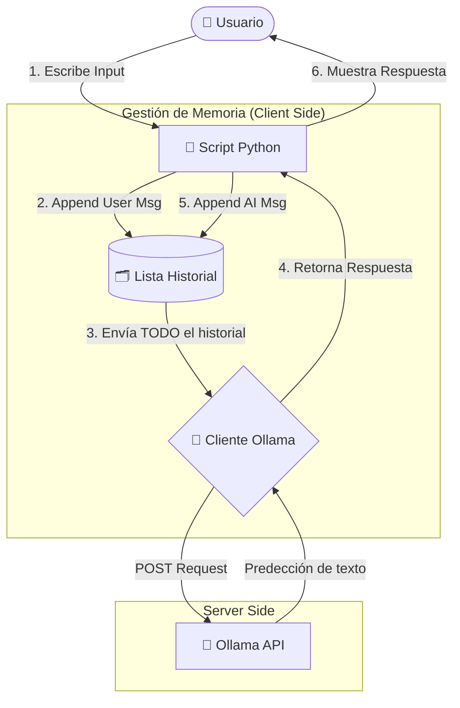

# 01. Abstracción con Python: El Investigador Privado

En este ejemplo, utilizamos la librería de Python para interactuar con Ollama. El objetivo es ver cómo unas pocas líneas de código pueden ocultar toda la complejidad de la comunicación con el LLM.

El script main.py levanta un chat infinito donde una IA (con personalidad de investigador privado) intentará sacarte información sin que te des cuenta.

## 🧠 ¿Qué está pasando realmente?

Aunque parece que la IA "recuerda" lo que le dices, en realidad el script de Python es quien gestiona la memoria.

Cada vez que tú escribes algo, el script toma toda la conversación previa y se la vuelve a enviar a Ollama. Ollama es "stateless" (sin estado); no sabe quién eres hasta que le enviamos el historial completo.

### Diagrama de Flujo





## 🛠️ Conceptos Clave del Código

- El Cliente (Client): Es la abstracción. Por debajo, esto no es más que una petición HTTP a http://localhost:11434/api/chat.

- El System Prompt: Es la "configuración de fábrica" de esta sesión. Define la personalidad.

- La Lista conversation_history: Es la "memoria RAM" del chat. Si reinicias el script, la IA olvida todo porque esta lista se borra.

## 🚀 Cómo ejecutarlo
Asegúrate de tener instaladas las dependencias:

```Bash
pip install ollama
```

### Opción A: Ollama en Local
Si tienes Ollama corriendo en tu propia máquina:

```Bash
python main.py
```

### Opción B: Ollama Remoto
Si tu Ollama corre en un servidor, en Docker, o en otra IP de tu red, usa la variable de entorno OLLAMA_HOST. El script está preparado para leerla.

```Bash
export OLLAMA_HOST="192.168.1.50"
python main.py
```

## 🧪 Experimento

Como curiosidad, podrias probar cambiando el system_prompt y ver que pasa, te dejo el archivo main_investigador.py para que veas como se comporta con otro prompt para trabajar.

Tambien otra cosa que puedes hacer es eliminar la parte del conversation_history.append(...) para ver como "el investigador secreto" pierde la memoria.

Todo esto parece simple no?, veamos en el proximo capitulo lo que esta pasando por abajo...

