# 01. Abstracción con Python: El Investigador Privado

En este ejemplo, utilizamos la librería de Python para interactuar con Ollama. El objetivo es ver cómo unas pocas líneas de código pueden ocultar toda la complejidad de la comunicación con el LLM.

El script `main.py` levanta un chat infinito donde una IA (con personalidad de investigador privado) intentará sacarte información sin que te des cuenta.

## 🧠 ¿Qué está pasando realmente?

Aunque parece que la IA "recuerda" lo que le dices, en realidad el script de Python es quien gestiona la memoria.

Cada vez que tú escribes algo, el script toma toda la conversación previa y se la vuelve a enviar a Ollama. Ollama es **stateless** (sin estado); no sabe quién eres hasta que le enviamos el historial completo.

### Diagrama de Flujo

```mermaid
graph TD
    User([👤 Usuario]) -->|1. Escribe Input| Script[📜 Script Python]
    
    subgraph "Gestión de Memoria (Client Side)"
    Script -->|2. Append User Msg| History[(🗂️ Lista Historial)]
    History -->|3. Envía TODO el historial| Client{🔌 Cliente Ollama}
    end
    
    subgraph "Server Side"
    Client -->|POST Request| API[🤖 Ollama API]
    API -->|Predección de texto| Client
    end
    
    Client -->|4. Retorna Respuesta| Script
    Script -->|5. Append AI Msg| History
    Script -->|6. Muestra Respuesta| User
```



## 🛠️ Conceptos Clave del Código

- **El Cliente (Client):** Es la abstracción. Por debajo, esto no es más que una petición HTTP a `http://localhost:11434/api/chat`.
- **El System Prompt:** Es la "configuración de fábrica" de esta sesión. Define la personalidad.
- **La Lista conversation_history:** Es la "memoria RAM" del chat. Si reinicias el script, la IA olvida todo porque esta lista se borra.

## 🚀 Cómo ejecutarlo
Asegúrate de tener instaladas las dependencias:

```Bash
pip install ollama
```

### Opción A: Ollama en Local
Si tienes Ollama corriendo en tu propia máquina:

```Bash
python main.py
```

### Opción B: Ollama Remoto
Si tu Ollama corre en un servidor, en Docker, o en otra IP de tu red, usa la variable de entorno `OLLAMA_HOST`. El script está preparado para leerla.

```Bash
export OLLAMA_HOST="192.168.1.50"
python main.py
```

## 🧪 Experimento

Como curiosidad, podrías probar cambiando el `system_prompt` y ver qué pasa. Te dejo el archivo `main_investigador.py` para que veas cómo se comporta con otro prompt para trabajar.

También otra cosa que puedes hacer es eliminar la parte del `conversation_history.append(...)` para ver cómo "el investigador secreto" pierde la memoria.

---

## ⏭️ Siguiente Paso

Todo esto parece muy simple gracias a Python, ¿verdad? Pero, ¿qué está pasando realmente en los cables?

👉 **[Capítulo 02: La Verdad del Request](../02_la_verdad_del_request)**
