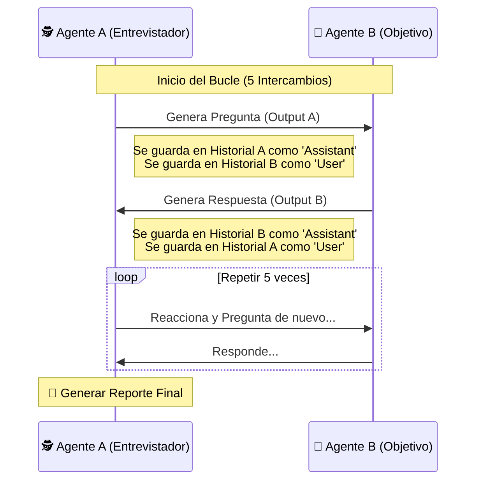

# 01. Conversación Simple (IA vs IA)

Hasta ahora, siempre hemos sido **Humanos vs Máquina**. Pero, ¿qué pasa si conectamos la salida de una IA a la entrada de otra?

**Importante:** A partir de ahora vamos a comenzar a cambiar un poco las palabras y ser más "precisos". Por lo tanto tenemos:
- **Agente:** Es el sistema completo. Incluye el `system_prompt`, la gestión del historial, el código de Python que orquesta todo.
- **LLM:** Es el cerebro sin estado. Solo procesa texto (entrada -> salida). Aquí vive Ollama y el modelo.

En este experimento, creamos dos agentes "autónomos":

- 🕵️ **El Entrevistador (Agente A):** Tiene la misión de descubrir 3 datos (Nombre, Profesión, Comida).
- 👷 **El Objetivo (Agente B):** Tiene una personalidad definida y está dispuesto a charlar (o no, todo depende de nuestro prompt).

## 🔄 El Bucle de Retroalimentación

El desafío técnico aquí es la **Gestión del Historial** y los diferentes perfiles que cargamos.

- Cuando el **Agente A** habla, su mensaje se guarda en su propio historial como `assistant`.
- **PERO**, ese mismo mensaje debe insertarse en el historial del **Agente B** como `user`.

De esta forma hacemos "creer" al LLM que la conversación es normal (máquina <-> humano). Si no hacemos este cruce de roles, los agentes no sabrán que el otro les está hablando.

> **Nota:** Me gusta seguir dándole una personalidad a todo esto, aunque todos sabemos que son modelos matemáticos...

### Diagrama del Proceso

Para ir entendiendo mejor el proceso y cómo se van a dar las iteraciones, aquí un pequeño esquema:

*Nota: Para no irnos mucho en la interacción entre los Agentes y que aparezcan "cosas raras", dejamos un máximo de 5 iteraciones entre el entrevistado y el objetivo.*

## 🎯 Objetivos del Script

1. **Automatización:** Ver cómo dos LLMs pueden mantener una conversación coherente sin intervención humana.
2. **Economía de Tokens:** Instruimos a los modelos a ser breves para que el chat sea dinámico.
3. **Extracción de Información:** Al final, le pedimos al Agente A que analice toda la conversación y extraiga datos estructurados.

## Reto

Aquí es el momento en donde podrías trabajar un poco más en todo esto:
- Prueba diferentes tipos de prompt, cada sutil diferencia puede hacer que todo cambie.
- Prueba cambiar por otro modelo (más pequeño, más grande, con thinking); el resultado puede ser increíblemente distinto.
- Prueba aumentar la iteración a 10, 100, o un bucle infinito...

---

## ⏭️ Siguiente Paso

Esto es divertido, pero son solo palabras. ¿Qué pasa si la IA tiene **necesidades**? ¿Hambre? ¿Sueño?

👉 **[Capítulo 02: Agentes con Estado](../02_agentes_con_estado)**
