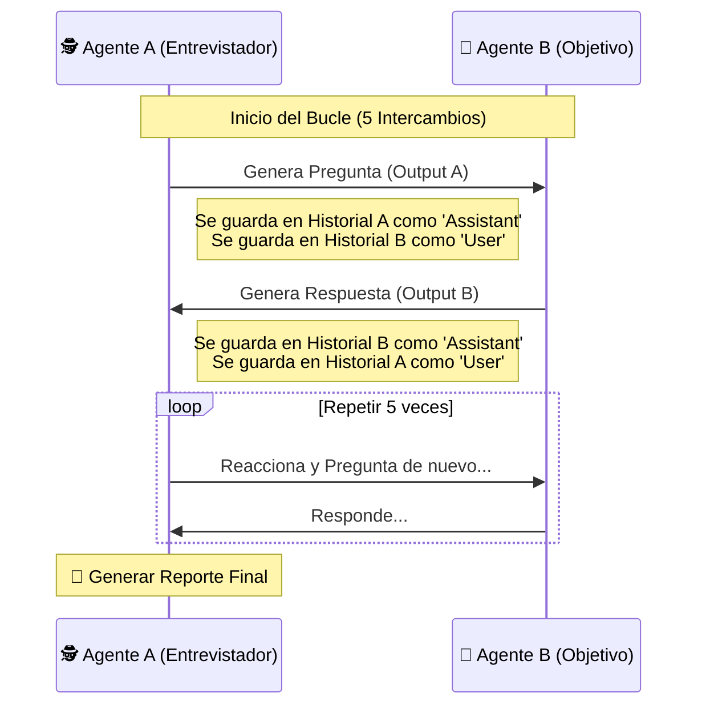

# 01. Conversación Simple (IA vs IA)

Hasta ahora, siempre hemos sido Humanos vs Máquina. Pero, ¿qué pasa si conectamos la salida de una IA a la entrada de otra?

Importante: a partir de ahora vamos a comenzar a cambiar un poco las palabras y ser mas "precisos". Por lo tanto tenemos:
- Agente: system_prompt, cual es el modelo que se va a ocupar, historial de conversaciones, en fin el codigo de python duro y puro.
- LLM: el cual es el cerebro, sin estado, solo procesa lo que le entra, aqui esta ollama y el modelo. 

En este experimento, creamos dos agentes ""autónomos"":

- 🕵️ El Entrevistador (Agente A): Tiene la misión de descubrir 3 datos (Nombre, Profesión, Comida).
- 👷 El Objetivo (Agente B): Tiene una personalidad definida y está dispuesto a charlar (o no, todo depende de nuestro prompt).

## 🔄 El Bucle de Retroalimentación

El desafío técnico aquí es la Gestión del Historial, y los diferentes perfiles que cargamos.

- Cuando el 'Agente A' habla, su mensaje se guarda en su propio historial como assistant.
- PERO, ese mismo mensaje debe insertarse en el historial del 'Agente B' como user, de esta forma hacemos "creer" al LLM que la conversacion es normal (maquina <-> humano).

Si no hacemos este cruce de roles, los agentes no sabrán que el otro les está hablando, y puede ser complicado para ellos entender la logica que existe.

Nota: me gusta seguir dandole una personalidad a todo esto, aunque todos sabemos que son modelos matematicos...

### Diagrama del Proceso

Para ir entendiendo mejor el proceso y como se van a dar las iteraciones, aqui un pequeño esquema sobre el proceso:

```mermaid
sequenceDiagram
    participant A as 🕵️ Agente A (Entrevistador)
    participant B as 👷 Agente B (Objetivo)
    
    Note over A,B: Inicio del Bucle (5 Intercambios)
    
    A->>B: Genera Pregunta (Output A)
    Note right of A: Se guarda en Historial A como 'Assistant'<br/>Se guarda en Historial B como 'User'
    
    B->>A: Genera Respuesta (Output B)
    Note left of B: Se guarda en Historial B como 'Assistant'<br/>Se guarda en Historial A como 'User'
    
    loop Repetir 5 veces
        A->>B: Reacciona y Pregunta de nuevo...
        B->>A: Responde...
    end
    
    Note over A: 📝 Generar Reporte Final
```

Nota: para no irnos mucho en la iteraccion entre los Agentes y que aparezcan "cosas raras" dejamos un maximo de 5 iteraciones entre el entrevistado y el objetivo.

## 🎯 Objetivos del Script

1. Automatización: Ver cómo dos LLMs pueden mantener una conversación coherente sin intervención humana.
2. Economía de Tokens: Instruimos a los modelos a ser breves para que el chat sea dinámico.
3. Extracción de Información: Al final, le pedimos al Agente A que analice toda la conversación y extraiga datos estructurados.

## Reto

Aqui es el momento en donde podriamos trabajar un poco mas en todo esto:
- Prueba diferentes tipos de prompt, cada sutil diferencia puede hacer que todo cambie.
- Prueba cambiar por otro modelo (mas pequeño, mas grande, con thinking) el resultado puede ser increiblemente distinto.
- Prueba aumentar la iteracion a 10 o 100, o while true.... 

