# 02. Agentes con Estado (Tool Calling Básico)

En el capítulo anterior, nuestras IAs eran cerebros flotando en el vacío. No tenían cuerpo, ni necesidades, ni forma de interactuar con el mundo.

En este capítulo, le damos un **"cuerpo virtual"** al Agente B mediante *Tool Calling*.

## 🧠 Concepto: Cerebro vs. Cuerpo

Un LLM por sí solo es texto que entra y sale. No puede "sentir" hambre. Para simular vida, separamos las responsabilidades:

1. **El Cuerpo (Script de Python):** Mantiene las variables de estado (saciedad, energía). Estas son variables globales que cambian con el tiempo.
2. **El Cerebro (Ollama):** Toma decisiones basadas en ese estado.
3. **Los Sentidos (Tools):** Son funciones que permiten al cerebro "mirar" sus variables o "modificarlas".

### El Estado del Agente

Definimos dos variables vitales que van de 0 a 100:

- 🥪 **Saciedad:**
  - 0: Muriendo de hambre.
  - 100: Completamente lleno.

- ⚡ **Energía:**
  - 0: Desmayado / Exhausto.
  - 100: Totalmente descansado.

### ¿Qué es Tool Calling?

Es la capacidad del modelo de decir: *"No quiero responder con texto todavía. Necesito ejecutar una función de código"*.

En este script, el Agente B tendrá acceso a dos Tools:
1. `check_status()`: Para saber cómo se siente (leer variables, el estado).
2. `perform_action(action)`: Para comer o dormir (modificar variables).

### Diagrama de Flujo (Cerebro-Cuerpo)

```mermaid
graph TD
    subgraph "Mundo Python (El Cuerpo)"
        State["📊 Variables de Estado<br/>Saciedad: 40<br/>Energía: 10"]
        Action["🛠️ Ejecutar Acción<br/>(Comer/Dormir)"]
    end

    subgraph "Ollama (El Cerebro)"
        Decision{"¿Necesito algo?"}
        Reply["💬 Responder al Chat"]
    end

    Input[Mensaje Entrante] --> Decision
    Decision -->|Estoy bien| Reply
    Decision -->|Me siento mal| Call[Tool Call: check_status]
    
    Call --> State
    State -->|Return: Energía Baja| Decision
    
    Decision -->|Tool Call: perform_action| Action
    Action -->|Actualiza Variables| State
    Action -->|Return: 'Dormiste y recuperaste energía'| Decision
```

## ¿Cómo funciona todo esto?

En este script verás cómo el modelo decide autónomamente cuándo llamar a una función y cuándo responder al usuario.

---

## ⏭️ Siguiente Paso

Esto parece magia, ¿verdad? El modelo "llama" a la función. Pero, ¿cómo lo hace? ¿Qué hay debajo del capó? Vamos a ensuciarnos las manos con `curl`.

🔙 **[Anterior: Conversación Simple](../01_conversacion_simple)** | 👉 **[Siguiente: Desarmando las Funciones](../03_desarmando_las_funciones)**
