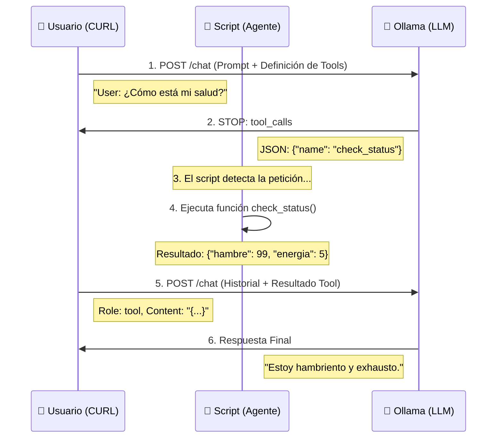

# 03. Desarmando las Funciones (Tool Calling con CURL)

En el script de Python anterior, todo ocurría muy rápido: el modelo decidía, el código se ejecutaba y el modelo respondía. Parecía magia.

Aquí vamos a detener el tiempo y ver el paso a paso usando `curl`.

## 🛠️ El Mito de la Ejecución

Es vital entender esto: **El LLM NO ejecuta tu código Python.**

1.  El LLM analiza tu texto.
2.  Decide que necesita un dato externo.
3.  Te devuelve un JSON especial (`tool_calls`) y **se pausa**.
4.  Tú (el Script/Agente) ejecutas la función en tu máquina.
5.  Tú le envías el resultado al LLM.
6.  El LLM continúa la frase.

## 📊 Diagrama de Secuencia

Observa cómo la "Lógica de Negocio" (Python) es quien realmente trabaja.

## 🧪 Los Scripts

- 01_peticion_con_tools.sh: Enviamos el prompt y le "enseñamos" al modelo qué herramientas existen (JSON Schema). Verás que el modelo no responde texto, sino una solicitud de herramienta.
- 02_respuesta_con_resultado.sh: Simulamos que ya ejecutamos la función y le devolvemos el resultado al modelo para que termine su frase.
- 03_peticion_con_accion.sh: en este caso veremos como ejecutar una funcion con parametros.
- 04_respuesta_accion_realizada.sh: la respuesta que hay que devolver, dado a que hicimos la accion.

