# 03. Desarmando las Funciones (Tool Calling con CURL)

En el script de Python anterior, todo ocurría muy rápido: el modelo decidía, el código se ejecutaba y el modelo respondía. Parecía magia.

Aquí vamos a detener el tiempo y ver el paso a paso usando `curl`.

## 🛠️ El Mito de la Ejecución

Es vital entender esto: **El LLM NO ejecuta tu código Python.**

1.  El LLM analiza tu texto.
2.  Decide que necesita un dato externo.
3.  Te devuelve un JSON especial (`tool_calls`) y **se pausa**.
4.  Tú (el Script/Agente) ejecutas la función en tu máquina.
5.  Tú le envías el resultado al LLM.
6.  El LLM continúa la frase.

## 📊 Diagrama de Secuencia

Observa cómo la "Lógica de Negocio" (Python) es quien realmente trabaja.

```mermaid
sequenceDiagram
    participant User as 👤 Usuario (CURL)
    participant Agent as 🤖 Script (Agente)
    participant LLM as 🧠 Ollama (LLM)

    User->>LLM: 1. POST /chat (Prompt + Definición de Tools)
    Note right of User: "User: ¿Cómo está mi salud?"
    
    LLM->>User: 2. STOP: tool_calls
    Note left of LLM: JSON: {"name": "check_status"}
    
    Note over Agent: 3. El script detecta la petición...
    Agent->>Agent: 4. Ejecuta función check_status()
    Note over Agent: Resultado: {"hambre": 99, "energia": 5}
    
    User->>LLM: 5. POST /chat (Historial + Resultado Tool)
    Note right of User: Role: tool, Content: "{...}"
    
    LLM->>User: 6. Respuesta Final
    Note left of LLM: "Estoy hambriento y exhausto."
```

## 🧪 Los Scripts

- `01_peticion_con_tools.sh`: Enviamos el prompt y le "enseñamos" al modelo qué herramientas existen (JSON Schema). Verás que el modelo no responde texto, sino una solicitud de herramienta.
- `02_respuesta_con_resultado.sh`: Simulamos que ya ejecutamos la función y le devolvemos el resultado al modelo para que termine su frase.
- `03_peticion_con_accion.sh`: En este caso veremos cómo ejecutar una función con parámetros.
- `04_respuesta_accion_realizada.sh`: La respuesta que hay que devolver, dado que hicimos la acción.

---

## 🏁 Fin del Viaje (Por ahora)

¡Felicidades! Has llegado al final de este recorrido.
Ahora sabes que:
1.  Los LLMs son "stateless".
2.  Podemos hablar con ellos vía HTTP.
3.  Existen muchos tipos de modelos.
4.  Podemos crear Agentes que usen herramientas.

¿Y ahora qué? ¡Experimenta! Crea tus propias herramientas, conecta bases de datos, haz que los agentes controlen tu casa inteligente. El límite es tu imaginación (y la VRAM de tu GPU).

🔙 **[Anterior: Agentes con Estado](../02_agentes_con_estado)** | 🏠 **[Volver al Inicio](../../README.md)**
